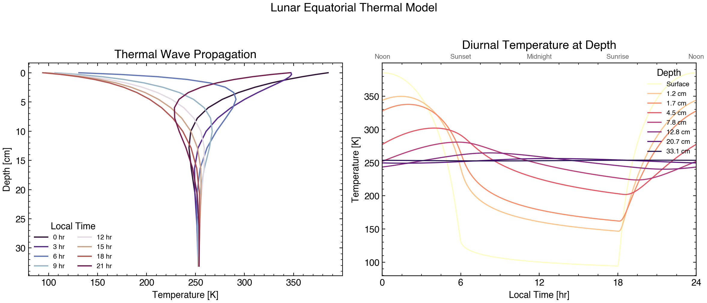
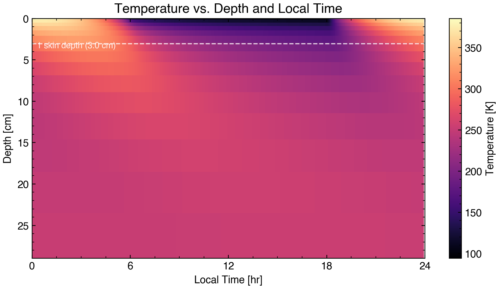
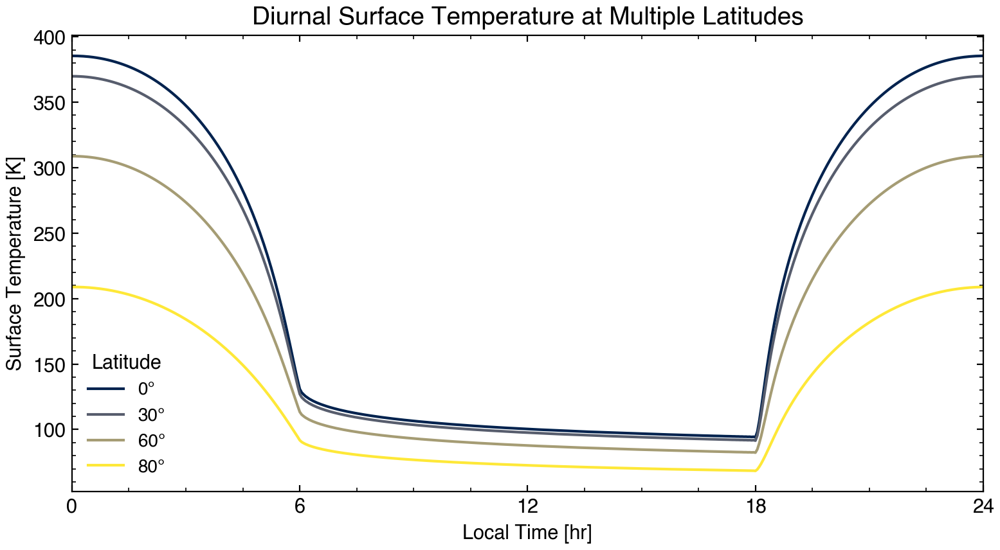
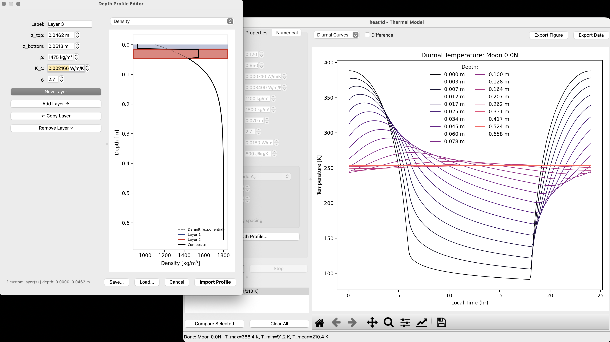

# heat1d

**One-dimensional thermal model for planetary science applications**

[](https://pypi.python.org/pypi/heat1d)
[](LICENSE)
[](https://heat1d.readthedocs.io)

`heat1d` solves the 1-D heat equation in planetary regolith with depth- and temperature-dependent thermophysical properties, following the formulation of [Hayne et al. (2017)](https://doi.org/10.1002/2017JE005387). Implementations are provided in Python, C, and MATLAB.



## Features

- **Four numerical solvers**: Explicit (Forward Euler), Implicit (Backward Euler), Crank-Nicolson, and Fourier-matrix (frequency domain)
- **Temperature-dependent properties**: thermal conductivity with radiative $T^3$ term, polynomial heat capacity
- **Depth-dependent profiles**: exponential density/conductivity transition with custom layer support
- **Angle-dependent albedo** following Keihm (1984)
- **Non-uniform spatial grid** with geometrically increasing layer spacing
- **Graphical user interface** (PySide6) with interactive parameter panel, run manager, and 5 plot types
- **JPL Horizons/SPICE integration** for precise ephemeris-driven illumination
- **Eclipse modeling** for satellite bodies (e.g., Moon in Earth's shadow)
- **PSR crater modeling**: bowl-shaped permanently shadowed regions ([Ingersoll & Svitek, 1992](docs/Ingersoll-Svitek_bowl-shaped-craters-frost_Icarus_1992.pdf))
- **YAML configuration** system with command-line overrides
- **Validation suite** against Apollo heat flow data and Diviner radiometer observations
- **C backend** for performance-critical applications

## Quick Start

### Installation

```bash
pip install heat1d
```

For the graphical user interface:

```bash
pip install "heat1d[gui]"
```

### Command Line

```bash
# Default: Moon equator, 1 diurnal cycle
heat1d

# Moon at 45 N with implicit solver, 2 output days
heat1d --lat 45 --solver implicit --ndays 2

# Load a YAML config file, override latitude
heat1d moon.yaml --lat 30

# Use JPL Horizons for real ephemeris
heat1d --use-spice --lat 0 --lon 0 --start-time "2024-06-15 12:00" --ndays 1

# Run the validation suite
heat1d --validate

# Launch the GUI
heat1d-gui
```

### Python API

```python
import numpy as np
import planets
from heat1d import Model, Configurator

config = Configurator(solver="crank-nicolson")
model = Model(planet=planets.Moon, lat=np.deg2rad(30), ndays=1, config=config)
model.run()

# Surface temperature vs local time
print(f"Peak T: {model.T[:, 0].max():.1f} K")
print(f"Min  T: {model.T[:, 0].min():.1f} K")

# Access depth grid and full T(time, depth) array
print(f"Grid: {model.N_z} layers to {model.profile.z[-1]:.2f} m depth")
```

## Example Output

### Temperature vs. Depth and Local Time

The thermal wave penetrates only a few centimeters into lunar regolith. Below the thermal skin depth (~7 cm, accounting for temperature-dependent conductivity and heat capacity), diurnal variations are strongly damped.



### Multi-Latitude Comparison

Peak daytime temperatures decrease with latitude due to lower solar incidence angles, while nighttime temperatures converge as all surfaces radiate to the same cold sky.



## Solvers

`heat1d` implements four numerical methods for the 1-D heat equation. Three are finite-difference time-stepping schemes; the fourth solves in the frequency domain:

| Solver | Method | Stability | Time Accuracy | Typical Steps/Day | Relative Speed |
|---|---|---|---|---|---|
| **Explicit** | Forward Euler | CFL-limited | $O(\Delta t)$ | ~830 | 1x |
| **Implicit** | Backward Euler + TDMA | Unconditional | $O(\Delta t)$ | ~24 | ~35x |
| **Crank-Nicolson** | Semi-implicit + TDMA | Unconditional | $O(\Delta t^2)$ | ~24 | ~35x |
| **Fourier-matrix** | Frequency domain | N/A (periodic) | Spectral | N/A | ~1000x |


### Time-Stepping Solvers

The **explicit scheme** (Hayne et al. 2017, Eq. A17) is a straightforward forward Euler discretization. It updates each grid node from its neighbors at the current time step, requiring no linear algebra. However, the CFL stability condition limits the time step to ~3000 seconds for typical lunar parameters, resulting in ~830 steps per synodic day.

The **implicit** and **Crank-Nicolson** schemes evaluate spatial derivatives at the new time level (fully or partially), producing a tridiagonal linear system at each step. This system is solved in O(N) time using the Thomas algorithm (TDMA). Because they are unconditionally stable, both schemes can take time steps ~35x larger than the explicit scheme. The Crank-Nicolson scheme averages explicit and implicit contributions, achieving second-order accuracy in time at the same computational cost as the first-order implicit scheme.

Both the implicit and Crank-Nicolson solvers support **adaptive time-stepping** via Richardson extrapolation (step doubling), automatically adjusting the time step to maintain a user-specified temperature accuracy.

### Fourier-Matrix Solver

The **Fourier-matrix solver** eliminates time-stepping entirely by solving the periodic steady-state in the frequency domain. It decomposes the diurnal surface flux into Fourier harmonics and propagates each frequency through the subsurface using 2×2 transmission matrices (analogous to electrical transmission lines). Nonlinear surface radiation is handled via Newton iteration in the time domain, using a circulant admittance matrix constructed from the frequency-domain impedance.

An outer iteration loop captures the **solid-state greenhouse effect** (thermal pumping): the nonlinear $T^3$ dependence of thermal conductivity produces a net downward heat flux that elevates subsurface temperatures. The solver computes the exact time-averaged rectification flux and adjusts the equilibrium temperature profile accordingly.

This approach is ~1000× faster than time-stepping because it solves the periodic steady state directly, without equilibration orbits. A complete lunar diurnal cycle is solved in ~100 ms. It is also the **default equilibration solver** -- even when using time-stepping methods for output, the Fourier solver initializes the temperature profile to the converged periodic state, eliminating multi-orbit spin-up.

For detailed equations and derivations, see the [Numerical Methods](python/docs/numerical.md) documentation.

## Graphical User Interface

The GUI provides interactive control over all model parameters with real-time visualization:

- **Parameter panel** with tabs for body selection, simulation settings, material properties, and numerical options
- **Run manager** for tracking and comparing multiple simulation runs
- **Five plot types**: diurnal curves, depth profiles, heatmaps, flux, and combined views
- **Publication-quality export** (PDF, PNG, SVG) and CSV data export
- **Parameter sweeps** across any model variable (linear or log spacing)
- **Custom depth profiles** via the layer editor for non-standard regolith structures
- **JPL Horizons search** for finding any solar system body by name



Install with `pip install "heat1d[gui]"` and launch with `heat1d-gui`.

## Theory

`heat1d` solves the 1-D heat equation in porous planetary regolith:

$$\rho \, c_p \frac{\partial T}{\partial t} = \frac{\partial}{\partial z} \left( K \frac{\partial T}{\partial z} \right)$$

with the following depth- and temperature-dependent material properties from Hayne et al. (2017):

- **Density**: exponential transition from surface (1100 kg/m³) to depth (1800 kg/m³) with scale height $H$
- **Thermal conductivity**: phonon (contact) conductivity plus a radiative $T^3$ component: $K = K_c \left[1 + \chi (T/350)^3 \right]$
- **Heat capacity**: 4th-order polynomial in temperature following Hemingway et al. (1981)
- **Surface boundary**: radiative equilibrium with angle-dependent albedo $A(\theta) = A_0 + a(\theta/45{^\circ})^3 + b(\theta/90{^\circ})^8$
- **Bottom boundary**: constant geothermal heat flux (0.018 W/m² for the Moon)

For full derivations, see the [Theory](python/docs/theory.md) documentation and [Hayne et al. (2017)](https://doi.org/10.1002/2017JE005387).

## Documentation

Detailed documentation is organized by topic:

| Topic | Description |
|---|---|
| [Theory](python/docs/theory.md) | Heat equation physics and flux formulation |
| [Thermophysical Properties](python/docs/properties.md) | Density, conductivity, and heat capacity models |
| [Boundary Conditions](python/docs/boundary.md) | Surface energy balance and bottom heat flux |
| [Numerical Methods](python/docs/numerical.md) | Solver equations, stability, and comparison |
| [Spatial Grid](python/docs/grid.md) | Non-uniform grid construction and skin depth |
| [Initialization](python/docs/initialization.md) | Temperature profile initialization |
| [Equilibration](python/docs/equilibration.md) | Convergence to periodic steady state |
| [Validation](python/docs/validation.md) | Comparison with Apollo and Diviner data |
| [CLI Reference](python/docs/cli.md) | Command-line options and examples |
| [API Reference](python/docs/api.rst) | Python class and function documentation |

Rendered documentation: [heat1d.readthedocs.io](https://heat1d.readthedocs.io)

## Validation

The model is validated against lunar temperature measurements from the Apollo 15 and 17 heat flow experiments and the Diviner Lunar Radiometer Experiment. All 8 validation checks pass within the published uncertainties across all four solvers.

```bash
heat1d --validate
```

See the [Validation](python/docs/validation.md) documentation for details.

## Citation

If you use `heat1d` in your research, please cite:

> Hayne, P. O., Bandfield, J. L., Siegler, M. A., Vasavada, A. R., Ghent, R. R., Williams, J.-P., Greenhagen, B. T., Aharonson, O., Elder, C. M., Lucey, P. G., & Paige, D. A. (2017). Global regolith thermophysical properties of the Moon from the Diviner Lunar Radiometer Experiment. *Journal of Geophysical Research: Planets*, 122, 2371-2400. [doi:10.1002/2017JE005387](https://doi.org/10.1002/2017JE005387)

## License

MIT License. See [LICENSE](LICENSE) for details.

## Authors

- **Paul O. Hayne** - University of Colorado Boulder (paul.hayne@lasp.colorado.edu)
- **K.-Michael Aye** - Package maintainer
