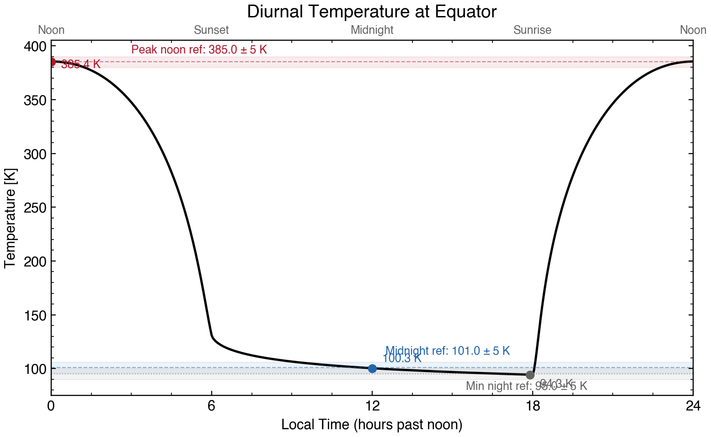
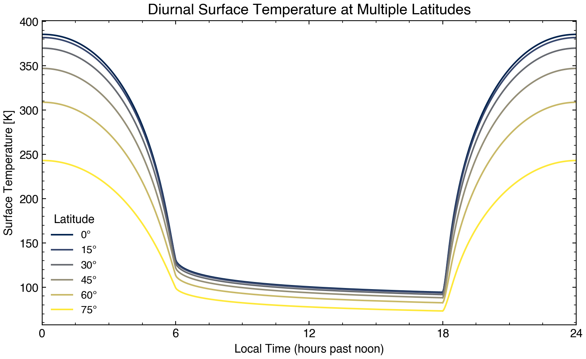
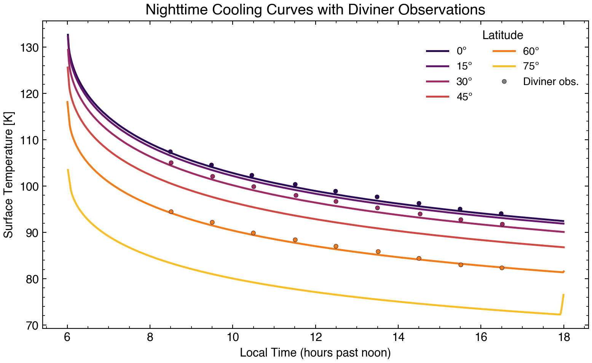
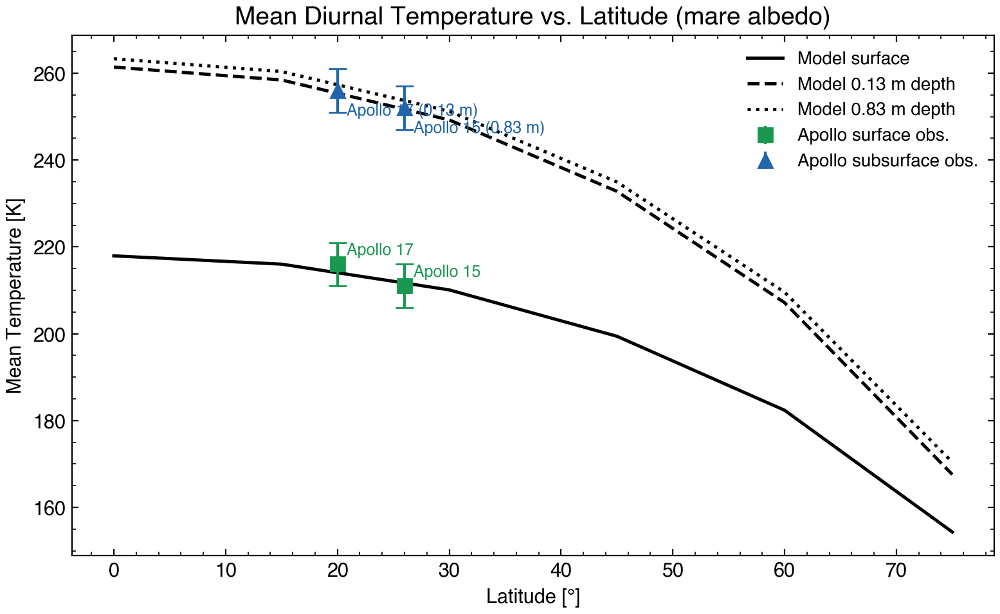

# Validation

The `heat1d` model is validated against lunar temperature data from
Hayne et al. (2017), Table A2, using constraints from Diviner observations
and Apollo heat flow experiments.

## Validation Constraints

The following constraints are used (Table A2 of Hayne et al., 2017):

**Equatorial temperatures** (latitude = 0, highland albedo $A_0$ = 0.12):

| Constraint | Value (K) | Tolerance |
|---|---|---|
| Peak noon temperature | 385 | ±5 |
| Midnight temperature | 101 | ±5 |
| Minimum nighttime temperature | 95 | ±5 |

**Apollo site mean temperatures** (mare albedo $A_0$ = 0.06):

| Constraint | Latitude | Value (K) | Tolerance |
|---|---|---|---|
| Apollo 15 surface mean T | 26°N | 211 | ±5 |
| Apollo 15 subsurface (0.83 m) mean T | 26°N | 252 | ±5 |
| Apollo 17 surface mean T | 20°N | 216 | ±5 |
| Apollo 17 subsurface (0.13 m) mean T | 20°N | 256 | ±5 |

### Mare vs. Highland Albedo

The equator checks use the default Moon highland normal bolometric Bond albedo
($A_0$ = 0.12). The Apollo landing sites are in dark mare regions with
significantly lower albedo. Following Hayne et al. (2017), which reports
$A_0$ = 0.12 for highland and $A_0$ = 0.07 for mare, the Apollo
checks use a mare albedo of $A_0$ = 0.06 appropriate for the particularly
dark basaltic floors at Hadley Rille (Apollo 15) and Taurus-Littrow (Apollo 17).

### Density/Conductivity Scale Depth

The validation suite uses the Hayne et al. (2017) Table A1 standard value for
the density and conductivity e-folding scale depth (*H* = 0.06 m), overriding
the `planets` package default of *H* = 0.07 m. This improves the fit to
Diviner nighttime cooling observations at all latitudes (RMS residual drops
from ~1 K to ~0.3 K).

## Energy Conservation

In addition to temperature comparisons, the validation suite checks energy
conservation by computing the stored energy change over one diurnal cycle.
For a well-equilibrated model, the relative energy imbalance should be < 1%.

## Running the Validation Suite

From the command line:

```bash
heat1d --validate
```

Or from Python:

```python
from heat1d.validation import run_validation_suite
results = run_validation_suite(solver="explicit", nyearseq=5)
```

## Validation Plots

The validation suite generates four diagnostic plots, shown below using the
Fourier-matrix solver with Hayne et al. (2017) standard parameters.

### Diurnal Equator Curve

Surface temperature vs. local time at the equator, with Table A2 reference
values and tolerance bands marked. The model closely matches the peak noon
temperature (385 K), midnight temperature (101 K), and minimum nighttime
temperature (95 K).



### Multi-Latitude Diurnal Curves

Surface temperature at 0, 15, 30, 45, 60, and 75 degrees latitude. Peak
daytime temperatures decrease with latitude due to lower solar incidence
angles, while nighttime temperatures converge as all surfaces radiate to
the same cold sky.



### Nighttime Cooling Curves

Surface temperature during the lunar night at multiple latitudes, overlaid
with Diviner Lunar Radiometer regolith temperature observations; note that these represent the rock-free regolith temperature (Bandfield et al., 2011). The model
reproduces the observed nighttime cooling behavior across all available
latitudes (similar to Figure A2 of Hayne et al., 2017).



### Mean Temperature vs. Latitude

Diurnal mean surface and subsurface temperature vs. latitude using mare
albedo, with Apollo 15 and 17 heat flow experiment data shown as points
with error bars. Surface measurements (squares) and subsurface measurements
at 0.13 m and 0.83 m depth (triangles) all fall within the published
uncertainties.



## Validation Results

With the Hayne et al. (2017) Table A1 standard properties (highland albedo for
equator, mare albedo for Apollo sites, *H* = 0.06 m), all 8 validation checks
pass. The Apollo checks use a finer grid (m=20, b=30) and longer equilibration
(25 orbits) to ensure the 0.83 m subsurface temperature is well converged:

```text
[PASS] equator_peak_noon_T: 388.5 K (ref: 385.0 +/- 5.0 K)
[PASS] equator_midnight_T: 100.2 K (ref: 101.0 +/- 5.0 K)
[PASS] equator_min_night_T: 93.7 K (ref: 95.0 +/- 5.0 K)
[PASS] energy_conservation: relative error = 0.0000
[PASS] apollo15_surface_mean_T: 209.1 K (ref: 211.0 +/- 5.0 K)
[PASS] apollo15_subsurface_mean_T: 252.9 K (ref: 252.0 +/- 5.0 K)
[PASS] apollo17_surface_mean_T: 211.7 K (ref: 216.0 +/- 5.0 K)
[PASS] apollo17_subsurface_mean_T: 255.4 K (ref: 256.0 +/- 5.0 K)
8/8 checks passed
```

### Regenerating Plots

To regenerate the validation plots for the documentation:

```bash
python docs/generate_validation_plots.py
```

This produces four PNG files in `docs/images/` using the Fourier-matrix solver
(fastest). The full validation suite (`heat1d --validate`) generates additional
comparison plots across all four solvers.

### References
Bandfield, J. L., Ghent, R. R., Vasavada, A. R., Paige, D. A., Lawrence, S. J., & Robinson, M. S. (2011). Lunar surface rock abundance and regolith fines temperatures derived from LRO Diviner Radiometer data. Journal of Geophysical Research: Planets, 116(E12). [https://doi.org/10.1029/2011JE003866](https://doi.org/10.1029/2011JE003866)